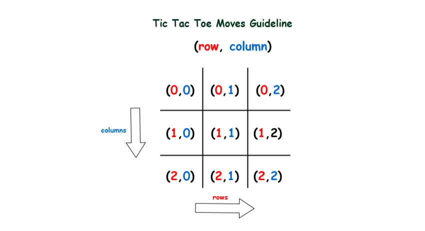

# 🎮 Tic Tac Toe Console Game

A simple two-player Tic Tac Toe game built in C# using a console renderer (`TicTacToeRendererLib`).



## ✅ Features

- Console UI with visual grid rendering
- Win and draw detection
- Retry on invalid moves
- Clean and minimal gameplay loop

## 🧰 Requirements

- .NET SDK
- Reference to `TicTacToeRendererLib`

## 🚀 Run Instructions

```bash
dotnet build
dotnet run
